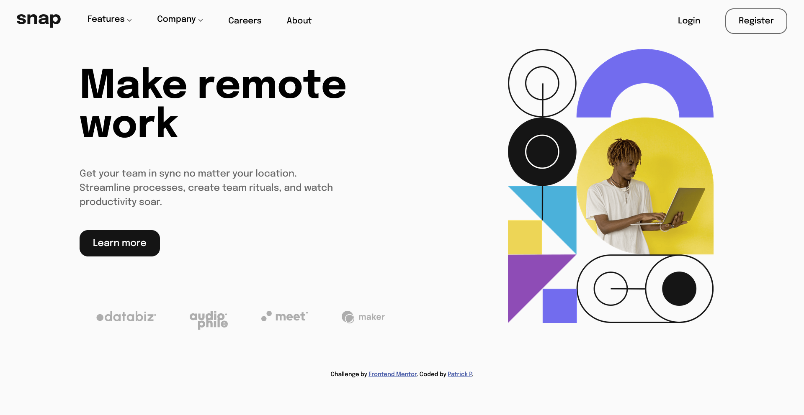

# Frontend Mentor - Intro section with dropdown navigation solution

This is a solution to the [Intro section with dropdown navigation challenge on Frontend Mentor](https://www.frontendmentor.io/challenges/intro-section-with-dropdown-navigation-ryaPetHE5). Frontend Mentor challenges help you improve your coding skills by building realistic projects. 

## Table of contents

- [Overview](#overview)
  - [The challenge](#the-challenge)
  - [Screenshot](#screenshot)
  - [Links](#links)
- [My process](#my-process)
  - [Built with](#built-with)
  - [What I learned](#what-i-learned)
  - [Continued development](#continued-development)
  - [Useful resources](#useful-resources)
- [Author](#author)

## Overview

### The challenge

Users should be able to:

- View the relevant dropdown menus on desktop and mobile when interacting with the navigation links
- View the optimal layout for the content depending on their device's screen size
- See hover states for all interactive elements on the page

### Screenshot



### Links

- Solution URL: [https://github.com/patrickp19/intro-section-with-dropdown-navigation-main](https://github.com/patrickp19/intro-section-with-dropdown-navigation-main)
- Live Site URL: [https://patrickp19.github.io/intro-section-with-dropdown-navigation-main/](https://patrickp19.github.io/intro-section-with-dropdown-navigation-main/)

## My process

### Built with

- Semantic HTML5 markup
- CSS custom properties
- Flexbox
- CSS Grid
- Mobile-first workflow


### What I learned

Height does not know height of parent so height: 100% will not work with transitions especially if the children are also changing heights
Instead use max-height for transitions

scale() does not affect the height of an element

A combination of background-image, aspect-ratio, background-size, background-position, flex-basis, and background-repeat: none can be used to create a background-image and allow for the image url to be modifiable from css

```js
// traverse child
.children
.childNodes
querySelector(".class-name") //make sure to include dot
//traverseParent:
.closest(".class-name")
.find
```


### Continued development

Future project focus:
- React
- Writing better semenatic css
- BEM

### Useful resources

- [Stack overflow](https://stackoverflow.com/questions/3508605/how-can-i-transition-height-0-to-height-auto-using-css) - Helped a lot throughout the project - especially with the transitions on the nav items
- [https://www.w3schools.com/] (https://www.w3schools.com/)
- [Kevin Powell](https://www.kevinpowell.co/) - great ideas on how to setup a nav bar
## Author

- Website - [https://github.com/patrickp19](https://github.com/patrickp19)
- Frontend Mentor - [@patrickp19](https://www.frontendmentor.io/profile/patrickp19)
